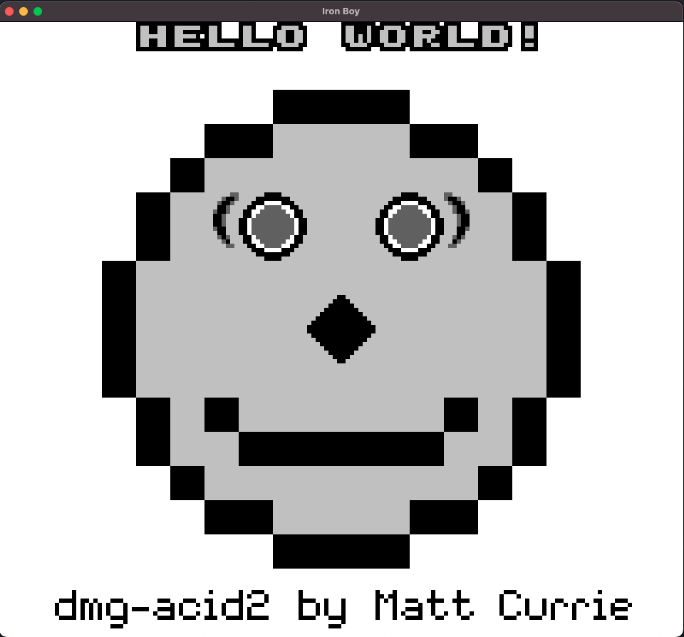
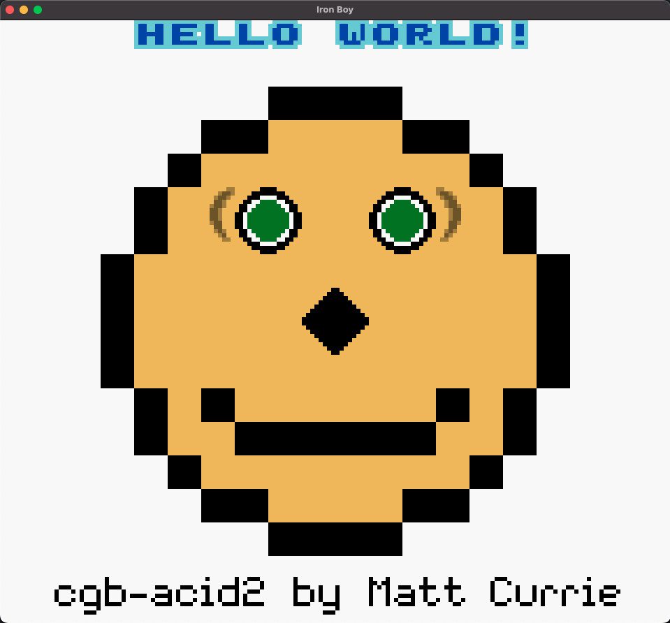

# Iron Boy

A GameBoy/GameBoy Color emulator, written in Rust.

https://github.com/user-attachments/assets/77a8e0a9-0890-4eb4-aa1e-8904ef2df1bd

## Features

- MBC1, MBC2, MBC3 (with RTC), MBC5 (no rumble)
- Sound
- DMG Support
- CGB Support
- Desktop Support

## Getting Started

Make sure you have the latest version of [Rust](https://www.rust-lang.org/tools/install) installed

### Mac OS with homebrew

`brew install sdl2`

### Ubuntu

`sudo apt update && sudo apt install -y libsdl2`

### Running

`cargo run <rom file path>`

- You can also build a release and run the executable as well

## Keymappings

| Joypad | Keyboard    |
| ------ | ----------- |
| A      | X           |
| B      | Z           |
| Start  | Space       |
| Select | Enter       |
| Up     | Up Arrow    |
| Down   | Down Arrow  |
| Left   | Left Arrow  |
| Right  | Right Arrow |

## Tests

- [ ] [Blargg's tests](https://github.com/retrio/gb-test-roms)

  - [x] cpu_instrs
  - [x] instr_timing
  - [ ] interrupt_time
  - [ ] mem_timing
  - [ ] mem_timing-2
  - [ ] oam_bug
  - [ ] halt_bug
  - [ ] cgb_sound
  - [ ] dmg_sound

- [x] [Single Step Tests](https://github.com/SingleStepTests/sm83)

- [x] DMG Acid test

- [x] CGB Acid test

## Acknowledgements and Sources

- [Pan Docs](https://gbdev.io/pandocs/About.html)
- [Game Boy Opcodes](https://izik1.github.io/gbops/)
- [gbz80(7) — CPU opcode reference](https://rgbds.gbdev.io/docs/v0.7.0/gbz80.7)
- [Ultimate Game Boy Talk](https://www.youtube.com/watch?v=HyzD8pNlpwI&t=1488s)
- [A journey into GameBoy emulation](https://robertovaccari.com/blog/2020_09_26_gameboy/)
- [GBEDG](https://hacktix.github.io/GBEDG/)
- [GhostSonic Reddit Post on Sound](https://www.reddit.com/r/EmuDev/comments/5gkwi5/comment/dat3zni/?utm_source=share&utm_medium=web3x&utm_name=web3xcss&utm_term=1&utm_content=share_button)
- [Game Boy Sound Emulation](https://nightshade256.github.io/2021/03/27/gb-sound-emulation.html)

### Awesome Emulators

These are some awesome emulators by some really smart people that helped me get to this point.

- [LLG_gbemu](https://github.com/rockytriton/LLD_gbemu)
- [gb-rs](https://github.com/simias/gb-rs)
- [rboy](https://github.com/mvdnes/rboy)
- [gaemboi](https://github.com/mario-hess/gaemboi)
